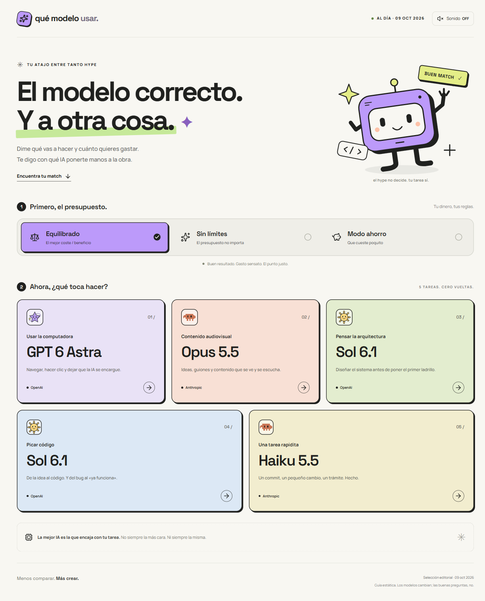
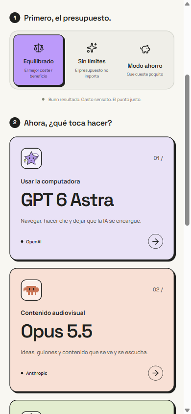
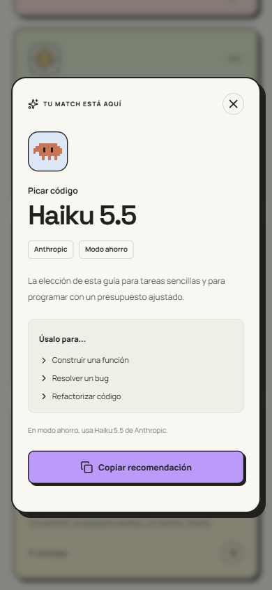

# Qué modelo usar

**El modelo correcto. Y a otra cosa.**

Una guía visual en español para elegir un modelo de IA según lo que vas a hacer y cuánto quieres gastar. Elige presupuesto, encuentra tu tarea y llévate una recomendación concreta, con ejemplos de uso y lista para copiar.

**5 tareas · 3 presupuestos · Sin registro · En móvil y escritorio**

[Ver capturas](#así-se-ve) · [Cómo funciona](#cómo-funciona) · [Desarrollo](#desarrollo)

## Así se ve

La vista de escritorio reúne el selector de presupuesto y las cinco tareas en una sola página.



| Elige desde el móvil | Abre una recomendación |
| :---: | :---: |
|  |  |

## Cómo funciona

1. **Elige tu presupuesto:** Equilibrado, Sin límites o Modo ahorro. Las recomendaciones se actualizan al cambiarlo.
2. **Busca lo que necesitas hacer:** usar la computadora, crear contenido audiovisual, pensar la arquitectura, picar código o resolver una tarea rápida.
3. **Abre la tarjeta:** consulta el modelo, su configuración cuando corresponda y ejemplos de uso. Copia la recomendación para tenerla a mano.

## Pequeños detalles que suman

- **Una elección clara por tarea.** Cada tarjeta muestra el modelo y su proveedor; el detalle añade contexto y ejemplos.
- **Una interfaz con personalidad.** Colores planos, mascotas animadas y un robot que cambia de aspecto con tu presupuesto.
- **Tus preferencias, guardadas.** Recuerda el presupuesto y la opción de sonido en tu navegador. El sonido empieza desactivado.
- **Cómoda también con teclado.** Incluye acceso directo a las recomendaciones, foco contenido en el diálogo y soporte de movimiento reducido.
- **Sin cuentas ni claves de API.** Puedes consultar la guía sin conectar ningún servicio de IA.

### Sobre las recomendaciones

La selección es editorial y está fechada en la propia web; la versión actual corresponde al **9 de octubre de 2026**. No consulta rankings ni precios en tiempo real, ni ejecuta los modelos: te ayuda a decidir con cuál trabajar. Las capturas reflejan esa selección.

## Desarrollo

Todo lo necesario para ejecutar, modificar y publicar el proyecto está en esta sección.

### Tecnologías y requisitos

Web estática hecha con **Vue 3, TypeScript, Vite y Tailwind CSS**. Las tipografías y los SVG se sirven desde el propio sitio. No requiere backend, base de datos, claves ni variables de entorno.

- **Node.js 24** para usar el mismo entorno con el que se ha comprobado el arranque local.
- **pnpm 11.2.0**, la versión fijada en `package.json`.

### Arranque local

```sh
git clone https://github.com/jonatancheca/QueModeloUsar.git
cd QueModeloUsar
pnpm install
pnpm dev
```

Abre [http://127.0.0.1:3005](http://127.0.0.1:3005). El puerto es fijo: si está ocupado, Vite avisa en lugar de arrancar en otro puerto.

### Comprobaciones y compilación

| Comando | Para qué sirve |
| --- | --- |
| `pnpm test` | Comprueba la lógica de las recomendaciones. |
| `pnpm typecheck` | Revisa los tipos con `vue-tsc`. |
| `pnpm build` | Comprueba los tipos y genera la web estática en `dist/`. |
| `pnpm preview` | Sirve la última compilación en [http://127.0.0.1:4173](http://127.0.0.1:4173). Requiere ejecutar antes `pnpm build`. |

### Dónde cambiar cada cosa

| Archivo | Contenido |
| --- | --- |
| [`src/data/recommendations.ts`](src/data/recommendations.ts) | Modelos, tareas, presupuestos, ejemplos y fecha de la selección editorial. |
| [`src/App.vue`](src/App.vue) | Página, selector de presupuesto y diálogo de recomendación. |
| [`src/style.css`](src/style.css) | Diseño, adaptación a móvil y animaciones. |
| [`src/components/RobotMascot.vue`](src/components/RobotMascot.vue) | Robot principal y sus variantes por presupuesto. |
| [`src/components/ModelMascot.vue`](src/components/ModelMascot.vue) | Mascotas SVG de los modelos. |
| [`src/composables/useSound.ts`](src/composables/useSound.ts) | Sonidos opcionales generados con Web Audio. |
| [`tests/recommendations.test.ts`](tests/recommendations.test.ts) | Pruebas de las reglas de recomendación. |

Al editar las recomendaciones, conserva estas reglas o actualiza también sus pruebas:

- Si una tarea no tiene una elección específica para un presupuesto, se mantiene su opción equilibrada.
- Haiku 5.5 de Anthropic se recomienda para Picar código en Modo ahorro y Una tarea rapidita en los tres presupuestos.
- Usar la computadora en Modo ahorro muestra «ni se te ocurra», sin recomendar un modelo ni mostrar ejemplos.

Actualiza también la fecha visible en `src/App.vue` cuando cambies la fecha editorial de los datos.

La interfaz debe seguir funcionando si el navegador bloquea almacenamiento, sonido o portapapeles. Las animaciones de las mascotas respetan `prefers-reduced-motion`.

### Capturas del README

Las imágenes se guardan en [`docs/screenshots/`](docs/screenshots/) para que GitHub pueda mostrarlas sin depender de un servidor externo. Si cambia la interfaz, vuelve a capturarlas desde la web local, con las tipografías cargadas y movimiento reducido:

- `escritorio.png`: página completa a 1280 px de ancho, con presupuesto Equilibrado.
- `movil.png`: vista de 390 × 844 px, desplazada hasta el selector de presupuesto.
- `recomendacion.png`: vista de 390 × 844 px, con el detalle de Picar código abierto en Modo ahorro.

### Publicación

Ejecuta `pnpm build` y publica la carpeta `dist/` en un alojamiento estático.

Para **Cloudflare Pages**, usa estos ajustes al conectar el repositorio mediante su integración Git:

| Ajuste | Valor |
| --- | --- |
| Rama de producción | `main` |
| Directorio raíz | Raíz del repositorio |
| Comando de compilación | `pnpm build` |
| Directorio de salida | `dist` |

Si el panel muestra un campo **Deploy command** con `npx wrangler deploy`, estás configurando Workers. Para este flujo, selecciona Pages, que publica los archivos generados después de compilar.

Los scripts de instalación de `esbuild` y `workerd` están autorizados en `pnpm-workspace.yaml` mediante `allowBuilds`, para evitar la pregunta interactiva de `pnpm approve-builds`.

Referencias: [Vue en Pages](https://developers.cloudflare.com/pages/framework-guides/deploy-a-vue-site/), [configuración de Workers Builds](https://developers.cloudflare.com/workers/ci-cd/builds/configuration/) y [permisos de scripts en pnpm](https://pnpm.io/settings/build#allowbuilds).
